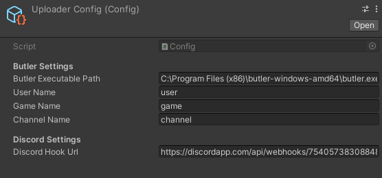
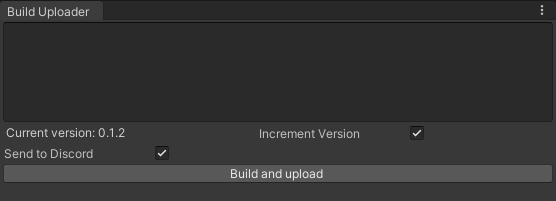

# Itch.io Uploader

Tool which allows for uploading game builds to itch.io from Unity editor. Additionally, discord web hook can be attached and the tool will broadcast a message when upload is successful.

### Required:
- Itch.io account
- Itch.io game page
- [Butler](https://itch.io/docs/butler/) installed and authenticated

### Installation:
1. Download latest [package](https://github.com/magalek/Itch.ioUploader/releases)
2. Add it into your Unity project
3. Use `Build Options/Build Window` menu option
4. Configure config file
5. Add scenes to your build settings (like with a normal Unity build)
6. Use `Build and Upload` option in the tool window

### Images

